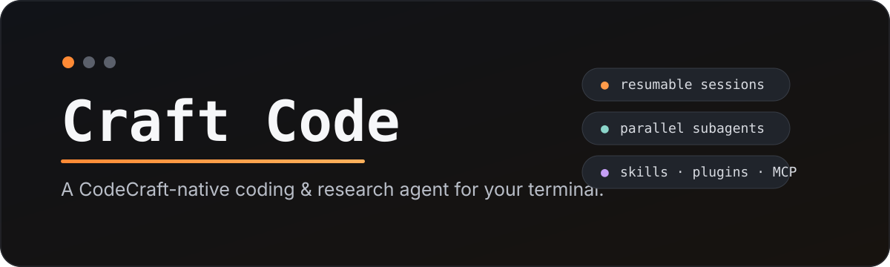
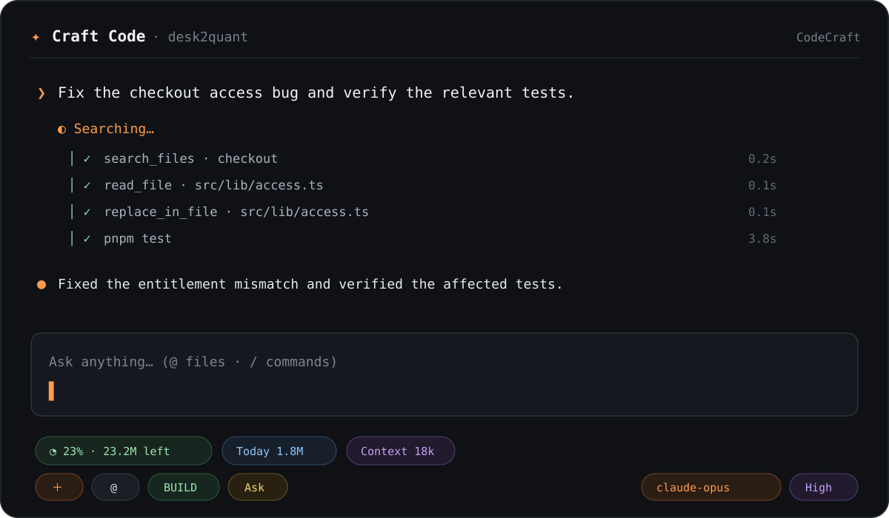

<div align="center">



<br />

[](https://www.npmjs.com/package/craftcode-codecraft)
[](https://github.com/AIM-IT4/craftcode-CLI/actions/workflows/ci.yml)
[](LICENSE)
[](https://nodejs.org/)
[](https://www.npmjs.com/package/craftcode-codecraft)

**A provider-agnostic coding & research agent for your terminal — CodeCraft, OpenRouter, and OpenAI-compatible APIs.**

Full-screen TUI · persistent sessions · parallel subagents · skills · Claude-style plugins · MCP/OAuth connectors · explicit permissions · token-aware execution

[Website](https://aim-it4.github.io/craftcode-CLI/) · [Quick start](#quick-start) · [Features](#what-you-get) · [Commands](docs/COMMANDS.md) · [Architecture](docs/ARCHITECTURE.md) · [Contributing](CONTRIBUTING.md)

</div>

---

## Quick start

```bash
npm install -g craftcode-codecraft
craftcode auth login                 # CodeCraft (backward-compatible default)
craftcode auth login openrouter      # or use OpenRouter
craftcode .
```

Authenticate once, then use Craft Code from any terminal. Provider keys are stored under your user profile, never inside the repository. `CODECRAFT_API_KEY` and `OPENROUTER_API_KEY` are also supported and take precedence over stored keys.

```bash
# Windows
craftcode C:\Users\you\project

# macOS / Linux
craftcode /path/to/project

# Continue the latest session
craftcode -c /path/to/project
```

<div align="center">
  
  <sub>Illustrative TUI preview — actual content, models and usage depend on your workspace and CodeCraft account.</sub>
</div>

## Why Craft Code?

Most coding agents hide at least one important thing: context growth, permission boundaries, connector actions, or how much model usage a task is consuming. Craft Code keeps those controls visible while still giving you a fast agentic workflow.

| Capability | Craft Code |
|---|---|
| Terminal UX | Full-screen interactive TUI with streaming, command palette, inline tool activity and clickable controls |
| Sessions | Search, resume, rename, fork, export and optional per-workspace auto-resume |
| Agents | Parallel bounded subagents, dependency-aware orchestration and isolated Git worktree writers |
| Context | `@file` references, model-window-aware compaction, interrupted-turn recovery, project instructions and bounded reads |
| Skills | Lazy `SKILL.md` loading with `.claude/skills` and `.agents/skills` compatibility |
| Plugins | Claude-style marketplaces, commands, skills and opt-in lifecycle hooks |
| Connectors | MCP over stdio/HTTP with OAuth support where available |
| Safety | Ask/Edit/Auto/Read-only presets, command policy, optional Docker shell sandboxing, checkpoints and undo |
| Providers | CodeCraft, OpenRouter, and configurable OpenAI-compatible endpoints behind one agent runtime |
| Tokens | Per-request/session/day accounting, lazy schemas, persistent safe-tool cache, provider rate metadata when available, and bounded retry handling |
| Code intelligence | TypeScript-AST symbols, definitions and references plus compact repository mapping |
| Runtime | Long-running process handles, project command discovery and credential-free deterministic evals |

## What you get

### Providers

```text
/providers
/provider
/provider codecraft
/provider openrouter
/model
```

OpenRouter setup:

```bash
craftcode auth login openrouter
craftcode .
# then inside Craft Code:
/provider openrouter
/model
```

For a custom OpenAI-compatible endpoint, add a provider to `~/.craftcli/config.json` or the workspace `.craftcli/config.json`:

```json
{
  "provider": "local",
  "providers": {
    "local": {
      "type": "openai-compatible",
      "baseUrl": "http://localhost:11434/v1",
      "auth": false
    }
  }
}
```

For an authenticated custom endpoint, set `apiKeyEnv` (for example `MY_GATEWAY_API_KEY`) or run `craftcode auth login <provider-id>`.

CodeCraft remains the default for legacy installations and existing configs/sessions.

### Professional terminal workflow

- Streaming responses with inline `Thinking…`, search, read, edit, test and review activity.
- Native terminal drag-selection + `Ctrl+C` copying works by default. Mouse wheel, Up/Down and PageUp/PageDown scroll the transcript; prompt history uses `Ctrl+P` / `Ctrl+N`. In native-selection mode Craft Code uses terminal alternate-scroll translation, while `/mouse on` switches to direct SGR mouse-wheel events. Clickable mouse controls are optional via `/mouse on`; `/mouse off` restores native selection.
- Inline red/green code edit previews directly under edit tool cards.
- Interactive `/model`, `/mode`, `/effort`, `/permissions`, `/style` and `/usage` controls, with a compact keyboard-first footer that never overlaps transcript output.
- Live context-window pressure in the footer plus `/doctor` health checks; long sessions compact before overflow and recover once automatically from recognized provider context/message-sequence 400s.
- Claude-inspired inline activity language (`✻ Thinking…`, `Tracing symbols…`, `Running tests…`, `Reviewing the diff…`) with `/style claude|classic|minimal`. Font family remains a terminal setting.
- File attachment/autocomplete with `@path/to/file`.
- Git checkpoints and `/undo`.
- Shell shortcut syntax such as `!git status` through command policy and the normal permission layer.
- Long-running dev servers and watchers use owned process handles instead of foreground command timeouts.

### Persistent sessions

```text
/sessions                    searchable session picker
/resume                      resume latest
/session name Checkout fix   rename current session
/session fork                branch the conversation
/session export              export transcript to Markdown
/session delete              remove current session
/settings autoresume on      reopen latest workspace session automatically
```

From the shell:

```bash
craftcode continue /path/to/project
craftcode -c /path/to/project
```

### Parallel subagents

```text
/agents
/agent spawn explorer "Find the auth flow"
/agent spawn reviewer "Review the checkout diff"
/team 3 "Investigate this regression from different angles"
/orchestrate "Trace this checkout regression and propose the safest fix"
```

Read-only workers can run concurrently with individual token ceilings. `/orchestrate` adds a planner, validated dependency graph and final reviewer so dependent investigations execute in the right order. Planner-generated worker roles are read-only. Writer agents remain a separate explicit path and are isolated in Git worktrees so concurrent edits do not collide with your main working tree.

### Semantic code intelligence and verification discovery

For JavaScript and TypeScript work, Craft Code can inspect AST-backed symbols, definitions and references instead of relying only on text search. It can also discover existing project-native test, lint, typecheck, build and dev commands before choosing verification commands.

### Shell policy, process handles and cache

Shell commands pass through a policy layer before the ordinary permission preset. Catastrophic host commands are denied, external-impact operations such as publish/deploy/push remain approval-gated, and an opt-in Docker mode can execute shell commands with networking disabled. Safe tool results can be persisted with metadata-based freshness checks; workspace mutations invalidate the local cache.

Use long-running process handles for dev servers, watchers and similar tasks. Craft Code owns those processes, keeps bounded logs, and stops them when the CLI exits.

Credential-free runtime checks are available without provider authentication:

```bash
craftcode eval runtime
```

The suite exercises command policy, TypeScript semantic lookup, project-command discovery, cache persistence and process lifecycle.

### Skills and Claude-style plugins

Skills are indexed by name/description and loaded only when relevant, instead of injecting every instruction into every model request.

```text
/plugin marketplace add DietrichGebert/ponytail
/plugin install ponytail@ponytail

/plugin marketplace add obra/superpowers-marketplace
/plugin install superpowers@superpowers-marketplace
```

Lifecycle hooks remain opt-in because installed plugins may execute local commands.

### Web, repositories and connectors

Use:

```text
/connect
/mcp
```

Craft Code supports stdio and HTTP MCP transports, lazy tool discovery and browser OAuth where the server supports it. Connector pickers identify Browser approval, Token / existing login, and Local service flows explicitly. `/connect vercel` launches Vercel's browser/device approval automatically through a transient `npx -y vercel@latest` invocation, so a global Vercel CLI install is not required. GitHub, Vercel, Supabase and other integrations remain behind the same permission model as local shell/file actions.

### Project-native instructions

Craft Code automatically picks up bounded instructions from:

```text
AGENTS.md
CLAUDE.md
.github/copilot-instructions.md
```

Useful commands:

```text
/init
/instructions
/instructions reload
/context
/status
/compact
```

## Permissions

| Preset | File edits | Shell commands |
|---|---|---|
| **Ask** | Ask | Ask |
| **Edit** | Allow | Ask |
| **Auto** | Allow | Allow |
| **Read only** | Deny | Deny |

External MCP actions are permission-gated as well. Plugin lifecycle hooks are disabled until explicitly enabled.

## Token-aware by design

Craft Code was built to avoid common agent-token waste:

- search before broad reads;
- bounded file/search/terminal output;
- lazy skill loading;
- lazy MCP tool-schema discovery;
- model-window-aware context compaction with output/tool-schema headroom;
- automatic repair/retry for interrupted tool-call history and recognized context-length 400s;
- per-agent budgets and TPM-aware parallelism;
- visible request/session/day/month usage;
- adaptive TPM pacing when the active provider exposes live token-rate headers, `Retry-After`/reset-aware retries, and TPM-aware subagent concurrency.

> [!IMPORTANT]
> CodeCraft plan allowance is inferred from CodeCraft rate-limit metadata when possible. For providers such as OpenRouter or custom endpoints where Craft Code does not have reliable plan metadata, the UI shows observed local usage instead of claiming an unlimited plan.

## Update

```bash
craftcode update
```

or:

```bash
npm install -g craftcode-codecraft@latest
```

## Development

```bash
git clone https://github.com/AIM-IT4/craftcode-CLI.git
cd craftcode-CLI
npm install
npm test
node src/index.mjs --version
```

Requires Node.js 20+.

Repository docs:

- [Command reference](docs/COMMANDS.md)
- [Architecture](docs/ARCHITECTURE.md)
- [Changelog](CHANGELOG.md)
- [Contributing](CONTRIBUTING.md)
- [Security policy](SECURITY.md)
- [Code of Conduct](CODE_OF_CONDUCT.md)

## Security

Treat repositories, skills, plugins and MCP output as untrusted input. Do not commit API keys or OAuth credentials. Security-sensitive reports should use GitHub private vulnerability reporting rather than public issues.

See [SECURITY.md](SECURITY.md).

## Project status

Craft Code is an independent open-source project and is evolving quickly. It is not affiliated with Anthropic, OpenAI, GitHub, Vercel, Supabase or CodeCraft unless explicitly stated by those projects.

Issues and pull requests are welcome.

## License

MIT © Craft Code contributors. See [LICENSE](LICENSE).
